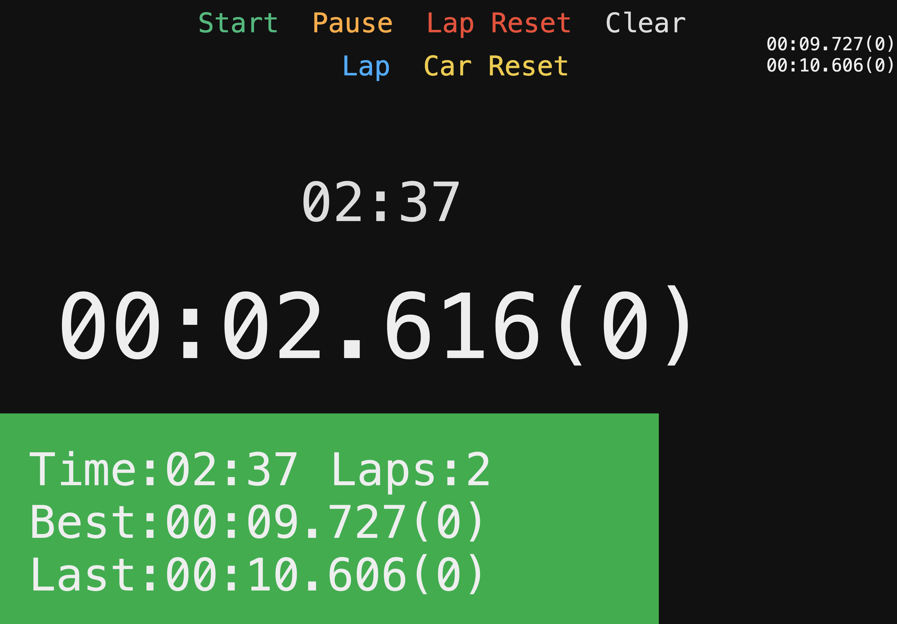

# deepracer-timer

Original code based on this [code](https://github.com/nalbam/deepracer-timer) and also this [blog post](https://blog.nalbam.com/3318) both written by Jungyoul Yu.

I've removed a lot of the code I don't currently need and changed / tidied for my needs running [AWS DeepRacer](https://aws.amazon.com/deepracer/) events.

## usage

```bash
./run.sh init
./run.sh start
./run.sh restart
./run.sh status
./run.sh stop
```

## screen



The green area exists to be used when streaming events using OBS by adding in as a video source and then using a chroma key filter.

## keymap

| Action  | Key |
| ------- | --- |
| Start   |  Q  |
| Pause   |  W  |
| Passed  |  E  |
| Reset   |  R  |
| Clear   |  T  |
| Squeeze |  Y  |
